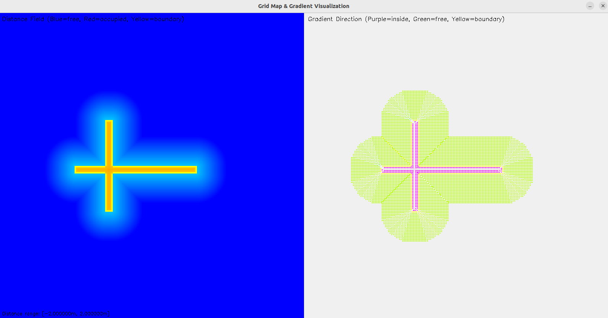
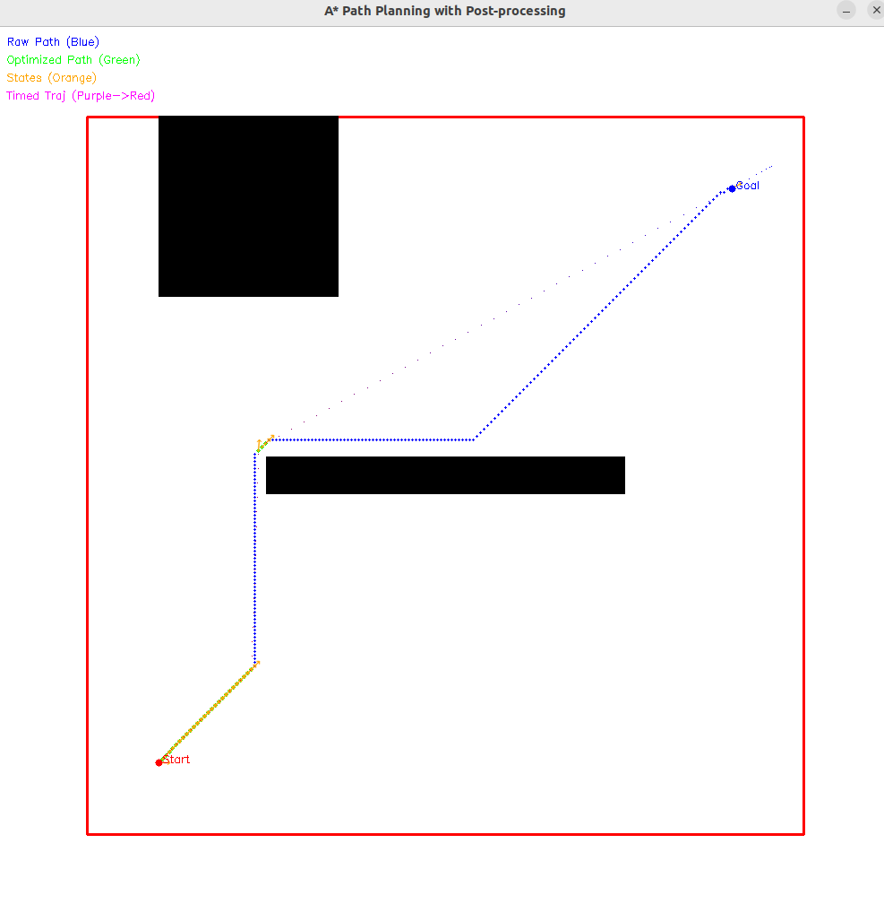
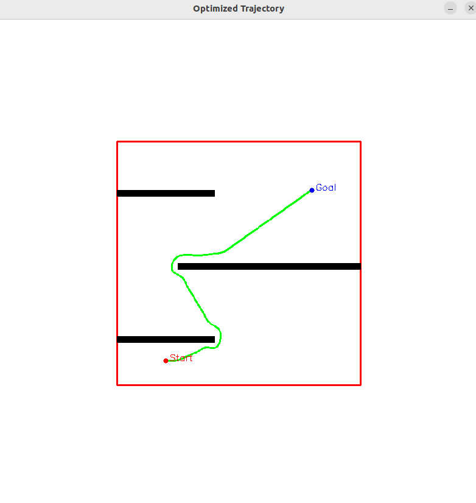

# ST-opt-tools: SplineTrajectory Optimization Tools

## 🚀 Overview

ST-opt-tools provides a complete pipeline for motion planning and trajectory optimization, featuring:

- Grid-based mapping with Euclidean Signed Distance Field (ESDF) computation
- A* path planning with post-processing and optimization  
- Trajectory optimization using L-BFGS with collision and dynamic constraints
- Smooth spline trajectory generation based on SplineTrajectory library
- Visualization tools for debugging and analysis

The system is specifically designed to work seamlessly with the [SplineTrajectory](https://github.com/Bziyue/SplineTrajectory) library, providing MINCO-equivalent trajectory optimization with superior performance.

## 📋 Project Structure

```
ST-opt-tools/
├── include/
│   ├── perception_tool/     # Grid mapping and ESDF computation
│   │   └── grid_map.hpp
│   ├── frontend_tool/       # A* path planning
│   │   └── astar.hpp
│   └── backend_tool/        # Trajectory optimization
│       ├── traj_opt.hpp
│       └── lbfgs.hpp
├── src/
│   ├── test_grid_map.cpp    # Grid map functionality tests
│   ├── test_astar.cpp      # A* planning tests
│   └── test_opt.cpp        # Full optimization pipeline test
└── CMakeLists.txt
```

## ⚡ Quick Start

### Prerequisites

- C++17 compatible compiler
- Eigen3 (≥ 3.3)
- OpenCV (for visualization)
- CMake (≥ 3.10)

### Installation

```bash
# Clone the repository
git clone https://github.com/MarineRock10/ST-opt-tools.git
cd ST-opt-tools

# Install dependencies
sudo apt install libeigen3-dev libopencv-dev

# Build the project
mkdir build && cd build
cmake .. && make

# Run tests
./test_grid_map    # Test grid mapping functionality
./test_astar       # Test A* path planning  
./test_opt         # Test full optimization pipeline
```

### Basic Usage

```cpp
#include "grid_map.hpp"
#include "astar.hpp"
#include "traj_opt.hpp"

// Create a grid map
auto map = std::make_shared<grid_map::GridMap>();
map->init(20.0, 20.0, 0.1);

// Set obstacles
grid_map::RowMatrixXi occupancy = /* your occupancy grid */;
map->setMap(occupancy);

// Plan with A*
path_planning::AStar astar(*map, 0.3);
auto trajectory = astar.planWithPostProcessing(start, goal);

// Optimize trajectory
TrajOpt::TrajectoryOptimizer optimizer(map, trajectory.optimized_path);
if (optimizer.plan()) {
    auto optimized_traj = optimizer.getOptimizedTrajectory();
    auto samples = optimizer.sampleTrajectory(0.1);
}
```

## 🎯 Key Features

### Grid Mapping & ESDF

- Efficient Euclidean Signed Distance Field computation
- Collision checking with safety thresholds
- Gradient computation for optimization

### A* Path Planning

- 8-direction search with post-processing
- Path optimization and smoothing
- State sampling and time allocation

### Trajectory Optimization

- L-BFGS-based optimization with multiple constraints:
  - Collision avoidance
  - Velocity limits
  - Dynamic feasibility
  - Path following
- Integration with SplineTrajectory for smooth output

## 📊 Results

### Example Outputs

**Figure 1**: Grid Map Visualization with ESDF  
  
*Visualization of the grid-based Euclidean Signed Distance Field (ESDF) showing obstacle boundaries (yellow), free space (blue gradient), and occupied space (red gradient).*

**Figure 2**: A* Path Planning Results  
  
*A-star algorithm path planning with obstacle avoidance. Blue points show the raw path, green points represent the optimized path after post-processing, and orange arrows indicate sampled states with orientation.*

**Figure 3**: Optimized Trajectory with Spline Fitting  
  
*Final optimized trajectory using L-BFGS optimization integrated with SplineTrajectory.*

## 🛠️ Integration with SplineTrajectory

ST-opt-tools is designed to work seamlessly with the [SplineTrajectory](https://github.com/Bziyue/SplineTrajectory) library:

```cpp
// After optimization, use SplineTrajectory for smooth motion
auto optimized_traj = optimizer.getOptimizedTrajectory();

// Sample at high frequency for control
std::vector<double> times = optimized_traj.generateTimeSequence(0.01);
auto positions = optimized_traj.evaluate(times, 0);
auto velocities = optimized_traj.evaluate(times, 1);
```

## 🔮 Future Work

We are excited to announce that ST-navigation-base, a complete navigation framework built on ST-opt-tools and SplineTrajectory, will be open-sourced soon. This framework will include:

- Real-time navigation stack
- ROS 2 integration
- Impressive computational speed and lower CPU usage
- Secure memory management and a clear modular structure

## 🙏 Acknowledgments

This project builds upon the excellent [SplineTrajectory](https://github.com/Bziyue/SplineTrajectory) library by Bziyue, which provides high-performance spline trajectory generation with mathematical optimality guarantees.

We thank the contributors to the Eigen and OpenCV projects for providing the fundamental building blocks.

## 📄 License

This project is licensed under the MIT License - see the LICENSE file for details.

